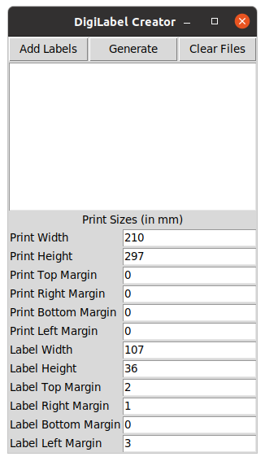

# DigiLabel
Convert multi-page label files into single pdf file

## Motivation
Originally designed for printing DigiKala label files with ordinary laserjet printers!

## Requirements
You need python3 and PyPDF2 package. Use pip for installing the dependency

    pip install -r requirements.txt
    
## How to use
Call `main.py` 
  python main.py -o output_file.pdf label1.pdf 
  
Command line:

    usage: main.py [-h] --output OUTPUTFILE labels [labels ...]

    Scale and merge multi-page label pdf files into single A4 PDF

    positional arguments:
      labels                Input label files

    optional arguments:
      -h, --help            show this help message and exit
      --output OUTPUTFILE, -o OUTPUTFILE
                            Output pdf file

For graphical user interface call `usrifc.py'
   
    python usrifc.py 

## Build for MS Windows
Single executable file can be build using `PyInstaller`.
Simply call `build_exe.bat`

                            

     
    
ابزار تبدیل فایل‌های لیبل دیجیکالا به یک فایل پی‌دی‌اف در قطع آ‌چهار! برای چاپ در پرینتر‌های معمولی

با این ابزار به عنوان مثال می‌توانید لیبل‌های دیجی‌کالا (یا هر نوع لیبل دیگری) را با پرینتر‌های معمولی چاپ کنید. 
فایل‌های PDF لیبل‌ها را داخل برنامه لود کرده و فایل A4 خروجی را ذخیره کنید. این فایل PDF رو با چاپگر بدون 
تغییر اندازه و حاشیه بر روی کاغذ لیبل چاپ کنید.

